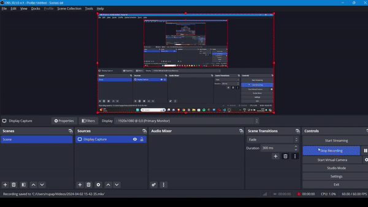
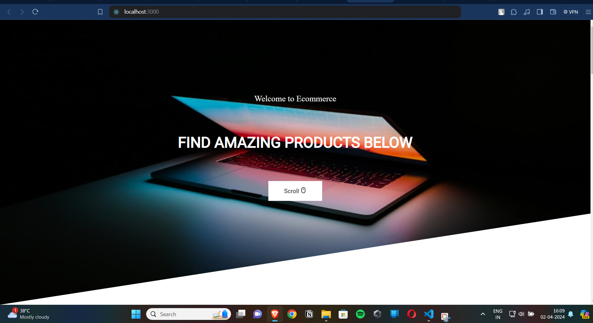
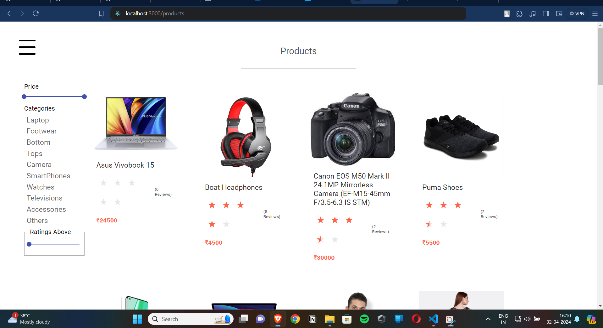
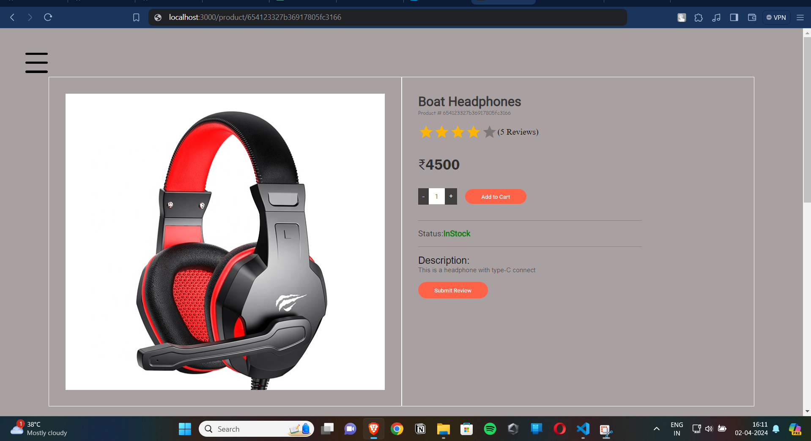
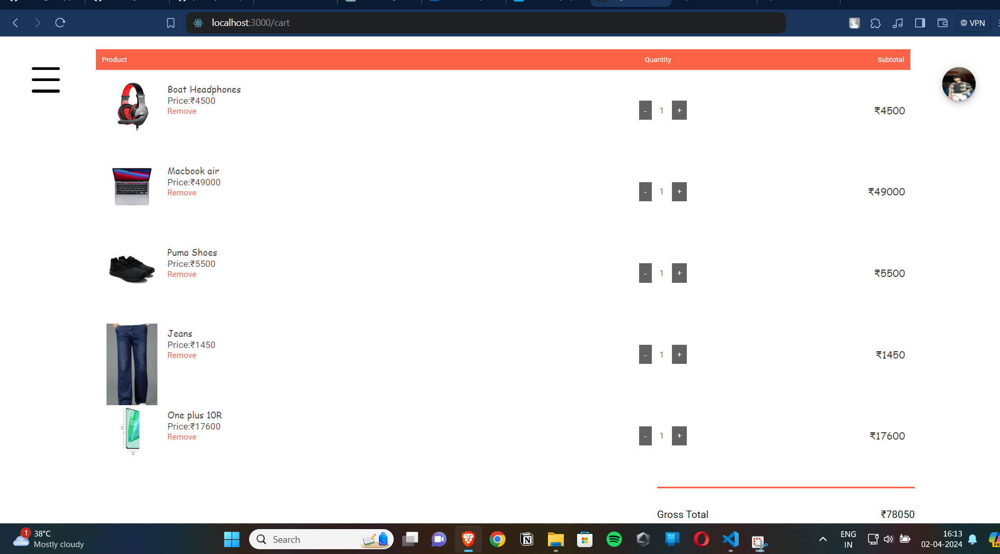

# MERN shopping Cart

Hi! My name is **Dhaval**, 

# Prerequisite

1.  Must have basic knowledge of **Node**, **React**, **Express**, **MongoDB**

# Install Dependencies

**For Backend** - `npm i`

**For Frontend** - `cd frontend` ` npm i`

## Env Variables

Make Sure to Create a config.env file in backend/config directory and add appropriate variables in order to use the app.

**Some Previews**

**Essential Variables**
PORT=""

DB_URI =""

STRIPE_API_KEY=""

STRIPE_SECRET_KEY=""

JWT_SECRET=""

JWT_EXPIRE=""

COOKIE_EXPIRE=""
  
SMPT_SERVICE =""

SMPT_MAIL=""

SMPT_PASSWORD=""

SMPT_HOST=""

SMPT_PORT=""

CLOUDINARY_NAME=""

CLOUDINARY_API_KEY=""

CLOUDINARY_API_SECRET=""

_fill each filed with your info respectively_

## Author

**Email : ** **rupaparadhaval1234@gmail.com**
**LinkedIn** Click [Here](https://www.linkedin.com/in/dhaval-rupapara-9b2889239/) **@dhavalrupapara**
